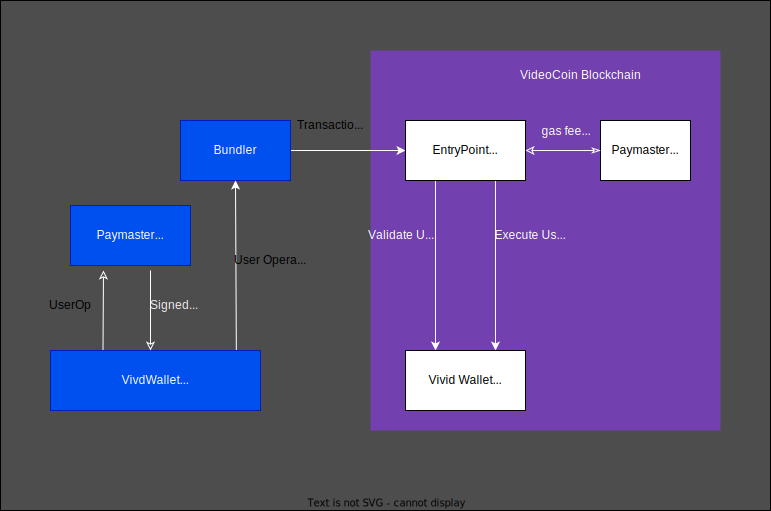
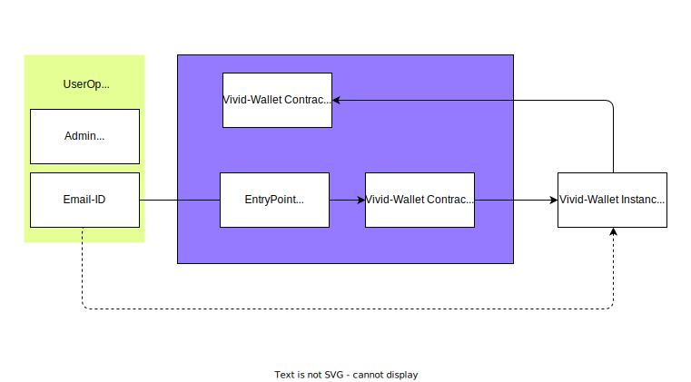

# Vivid Wallet

## Purpose
Mapping email-id with an Ethereum address using ERC4337 Account Abstraction

## Benefits of using ERC4337 for Vivid Wallet
* decentralized: A unique mapping between email(hash of email) and signing key can be established on chain.
* Efficient gas fee sponsoring (future enhancement): A designated account can provide the gas fee for the NFT transactions instead of prefunding the accounts.
* Allow non-custodial wallet operation(future enhancement): NFT operations can be authorized using email credentials instead using a private-key. 

## Overview



### Core Components
* EntryPoint
* Bundlers
* Paymasters
* Contract Account (Smart Wallet)
* User Operations Builder + Signer

The ERC4377 specification[1] describes the operation of the above components. We leverage the open source implementation of some of these components and modified as described below.

* For Bundler, we use open source repo[7] https://github.com/stackup-wallet/stackup-bundler  
  
The above repos are included as sub modules in this repo.  
* For EntryPoint, we use the open source repo[6] https://github.com/eth-infinitism/account-abstraction.
* User Operations builder + signer is implemented leveraging the repos https://github.com/stackup-wallet/userop.js and https://github.com/stackup-wallet/erc-4337-examples
This implementation is present in the folder vivid-wallet-cli.
* Smart wallet is developed based on the samples from https://github.com/eth-infinitism/account-abstraction

README.md in each folder(repo) is updated to describe the changes required for Vivid-Wallet.

## Email bound Vivid-Wallet
Unique mapping from email-id to Vivid-Wallet is achieved using hash of the email-id be embedded in initialization code of vivid-wallet. The deployment script creates a uniqe wallet address for the email-id.



Future update may include credentials provided by an ID-Provider to authorize the operation.

## Testing
This section describes the flow for generation of a Vivivd Wallet bound to an Email(Hash) using ERC-4337.   
Test Accounts hardcoded in the deployment scripts.
```
# Admin/Authenticator
Address:        0xcbd0D5480AAE8091683e8a811fC97Da84E01575b
Private key:    0bcdff379067e2cd2841574bf888297b9cd1e86e518161a758eefa1477615496
# Bundler
Address:        0x03320F959788d12D5D636B971c40604a371Dcc9f
Private key:    a1672c8caeffd52c793f65d240a74047365adbbc47c18af5286a8f857f0b0e2e

```
Run Geth in dev mode
```
geth --dev --http --http.api eth,web3,net,debug
```

Deploy EntryPoint and Vivid-Walet-Factory contractscontracts.
```
cd vivid-wallet-erc4337/account-abstraction
yarn hardhat deploy --network dev --reset
```
Update ABI files in the vivid-waller-cli and generate typechain
```
cd vivid-wallet-erc4337/vivid-wallet-cli/userops
cp ../../account-abstraction/artifacts/contracts/samples/VividAccount.sol/VividAccount.json ./abi/
cp ../../account-abstraction/artifacts/contracts/samples/VividAccountFactory.sol/VividAccountFactory.json ./abi/
yarn run gen:types
```

Update vivid-wallet-cli configuration file with factory address
```
vi config.json
#"vividAccountFactory": "",
#"emailId": ""
```

Run Stackup Bundler
```
cd vivid-wallet-erc4337/stackup-bundler
make dev-private-mode
./tmp/stackup-bundler start --mode private
```

Create vivid-wallet instance corresponding to the email
```
cd vivid-wallet-erc4337/vivid-wallet-cli
yarn ts-node scripts/vividAccount/index.ts address
```

Fund the test vivid-wallet created above
```
geth attach http://localhost:8545
web3.eth.sendTransaction({from: <coinbase>, to: <test vivid-wallet>, value: web3.toWei(1, "ether")})
```
Test transfer form vivid-wallet
```
cd vivid-wallet-erc4337/vivid-wallet-cli
yarn ts-node scripts/vividAccount/index.ts transfer --to "0xf39Fd6e51aad88F6F4ce6aB8827279cffFb92266" --amount 0.1
```

## References
1. Account Abstraction Using Alt Mempool  
https://eips.ethereum.org/EIPS/eip-4337
2. Attestation Infrastructures for Private Wallet  
https://arxiv.org/pdf/2102.12473.pdf
3. EIP-1014: Skinny CREATE2  
https://eips.ethereum.org/EIPS/eip-1014
4. ERC-2470: Singleton Factory    
https://eips.ethereum.org/EIPS/eip-2470
5. Implementation of contracts for ERC-4337 account abstraction via alternative mempool.  
https://github.com/eth-infinitism/account-abstraction
6. Smart wallet with google authenticator  
https://github.com/hotpot4337/contracts
7. Smart wallet using account abstraction examples  
https://github.com/stackup-wallet/erc-4337-examples
8. A simple JS library for building ERC-4337 UserOperations.  
https://github.com/stackup-wallet/userop.js
9. A modular Go implementation of an ERC-4337 Bundler.  
https://github.com/stackup-wallet/stackup-bundler
10. deterministicDeployment (ability to specify a deployment factory)  
https://github.com/wighawag/hardhat-deploy#4-deterministicdeployment-ability-to-specify-a-deployment-factory
11. Deterministic Deployment Proxy   
https://github.com/Arachnid/deterministic-deployment-proxy

